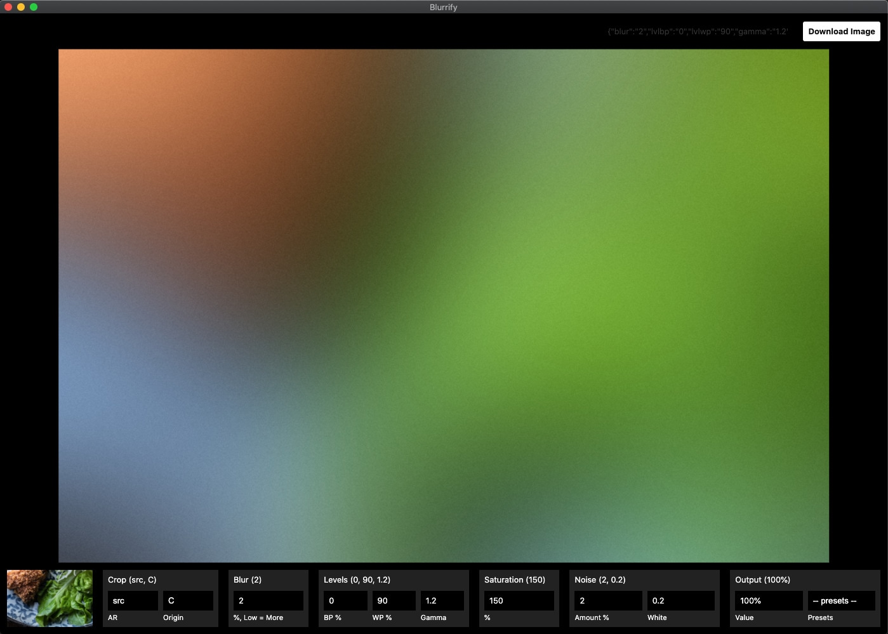

# blurrify


Wow! Would ya look at that!



## Updating instructions

jump to Step 3 of Installation instructions.

## Installation instructions

mac only. you have to have imagemagick installed on your machine. we are using homebrew to install imagemagick.

you can test if either of these are installed with `brew -v` and `convert -v` for imagemagick.

### Step 1: install homebrew

```sh
/bin/bash -c "$(curl -fsSL https://raw.githubusercontent.com/Homebrew/install/master/install.sh)"
```

### Step 2: install imagemagick using homebrew

```sh
brew install imagemagick
```

### Step 3: download latest version

Visit [/dist](https://github.com/jake-tock/blurrify/tree/main/dist) to get the latest version of the app dmg file.

Download it, mount the dmg and move to your applications folder.

> first time opening, you may have to find it and `right click > open` it because apple doesnt trust it. nor should it. once you do that, you should be fine opening it however you open applications.
